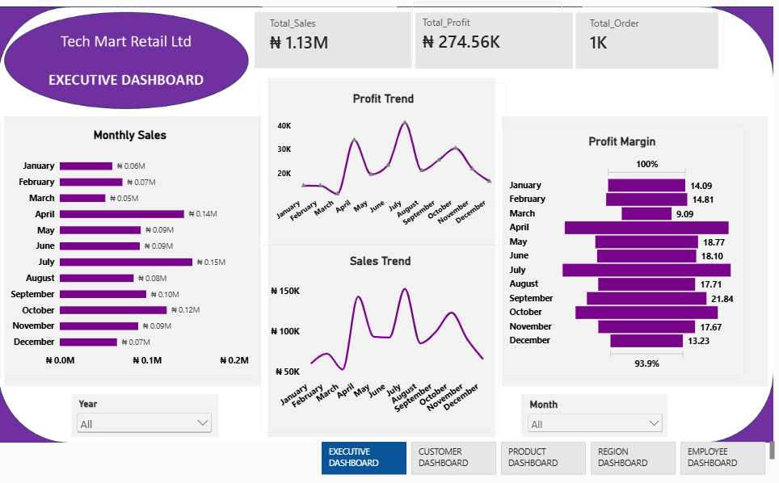
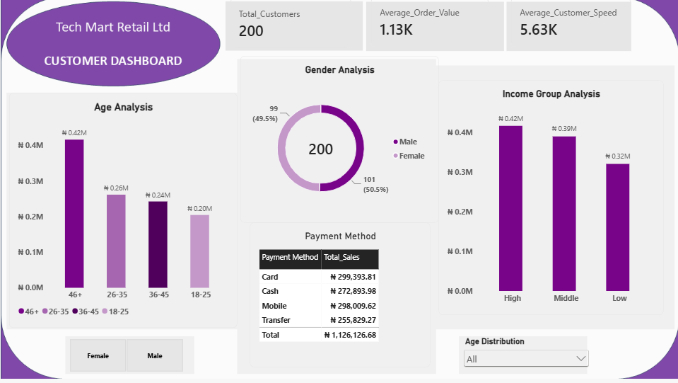
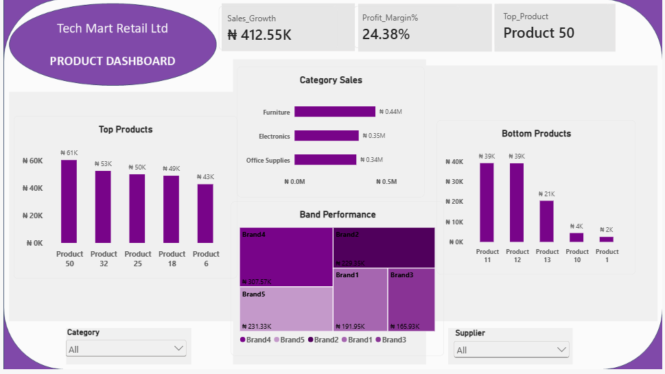
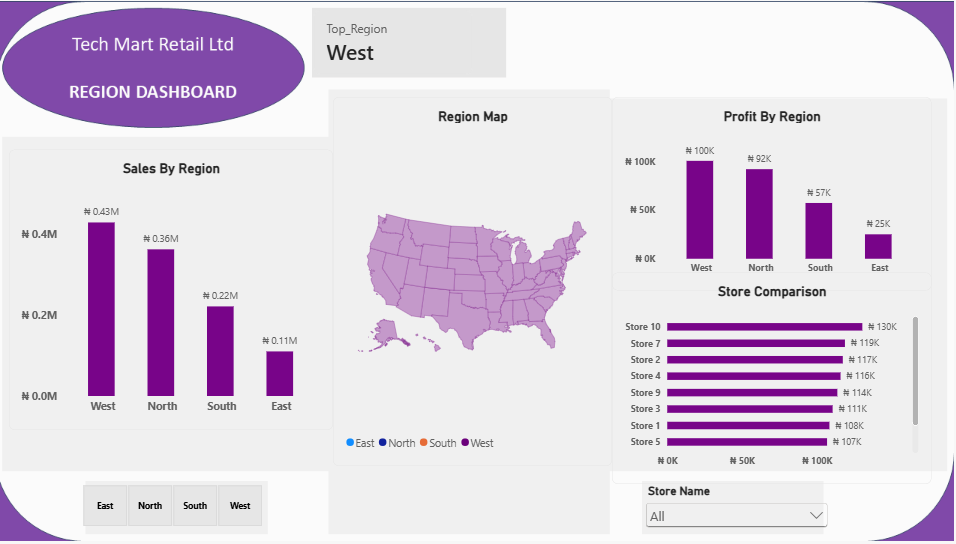
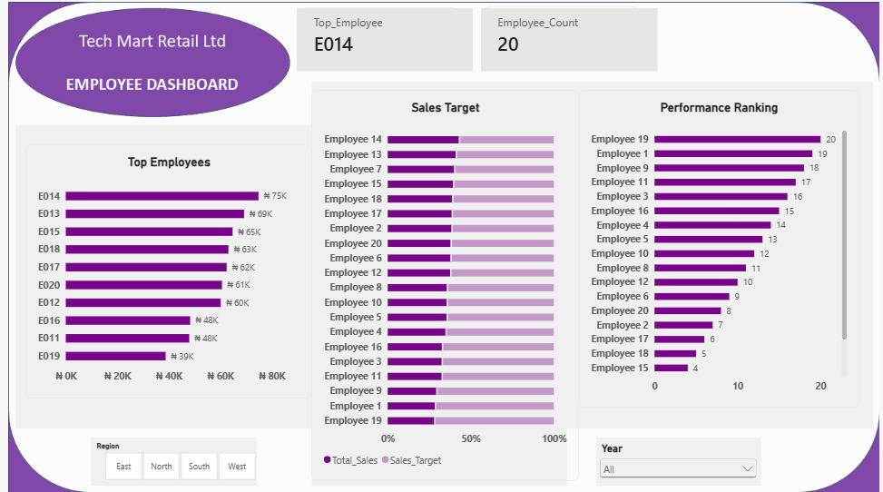

# Tech Mart Retail Ltd — Sales Analytics Dashboard

## Project Overview
An end-to-end Power BI sales analytics project for Tech Mart Retail Ltd. The dashboard turns retail sales and customer data into interactive views for executive, customer, product, regional, and employee performance analysis.

## Business Objectives
- Monitor sales, profit, orders, and margin.
- Analyse monthly sales and profit trends.
- Understand customer demographics and purchasing behaviour.
- Identify high- and low-performing products and brands.
- Compare regional and store performance.
- Monitor employee sales and target achievement.
- Monitoring the most reliable payment method.

## Key KPIs
The dashboard tracks:
-  Total Sales
-  Total Profit
-  Profit Margin % T
-  Total Orders
-  Customer Performance
-  Regional Sales
-  Product Performance
-  Employee Performance
-  Dashboard Pages
- Executive Dashboard

### Data cleaning
The preparation process included:
- Handling missing/null values
- Correcting data types
- Reviewing duplicate records
- Standardizing categorical fields
- Checking date fields
- Validating numerical fields
- Preparing fields required for analysis

## Tools used
### Power Query
Used for data transformation and preparation, including cleaning, restructuring, changing data types, and handling missing values.

### Power BI
Used for data modeling, DAX calculations, visualization, interactive reporting, and dashboard development.
- Drill-through — allows users to move from summary views into detailed analysis.
- Bookmarks — used for guided navigation and different dashboard views.
- Tooltips — provide additional information when users hover over visuals.
- Slicers & Filters — allow users to interact with the dashboard and focus on specific segments.

### Excel
Used for preliminary data review, PivotTables, and validation.

## Dashboard Preview

### Executive Dashboard
KPIs include Total Sales (₦1.13M), Total Profit (₦274.56K), Total Orders (1K), and Profit Margin (24.38%). Visuals include Monthly Sales, Sales Trend, Profit Trend, Profit Margin, and time filters.

### Customer Dashboard
KPIs include 200 customers, ₦1.13K average order value, and ₦5.63K average customer spend. Visuals cover age, gender, income group, and payment method.

### Product Dashboard
KPIs include ₦412.55K sales growth, 24.38% profit margin, and Product 50 as the top product. Visuals cover top/bottom products, category sales, and brand performance.

### Regional Dashboard
Compares West, North, South, and East using sales, profit, region map, and store comparison visuals.

### Employee Dashboard
Shows the top employee, employee count, sales targets, and performance ranking.

## Tools & Technologies
- Power BI — dashboard development, data modelling, DAX, and visualisation
- Power Query — data preparation and transformation
- PivotTables — analysis and validation
- GitHub — portfolio documentation and version control

## Data Preparation
The workflow included reviewing the source data, handling nulls, correcting data types, transforming fields with Power Query, preparing data for analysis, and validating results with exploratory analysis and PivotTables.

## Data Analysis Approach
The project followed a structured analytical workflow:

Raw Data → Data Cleaning → Data Transformation → Data Modeling → Analysis → Visualization → Insights → Recommendations

The analysis was designed to move beyond simply displaying numbers by connecting the results to potential business decisions.

## Key Findings
The dashboard identified several notable performance differences.

### Regional performance
The West region records the strongest sales performance, while the East region records the lowest sales among the four regions shown in the dashboard.

### Product performance
The analysis highlights differences between high- and low-performing products, providing an opportunity to investigate demand, pricing, availability, and customer preferences.

### Employee performance
Employee-level analysis identifies differences in sales contribution and provides a basis for understanding performance patterns.

### Financial performance
Sales, profit, and profit margin provide complementary measures of business performance rather than relying on revenue alone.

## Technical Skills Demonstrated
Area	                            Skills
Data Cleaning	                Missing values, data types, validation
Data Transformation	            Power Query
Data Analysis	                Aggregation, segmentation, trend analysis
Data Modeling	                Relationships and analytical structure
DAX	                            KPI and business calculations
Visualization	                KPI cards, charts, trends, regional analysis
Business Intelligence	        Interactive dashboards
Business Analysis	            Insights and recommendations

## Business Recommendations
Based on the analysis:
- Maintain strategies supporting high-performing regions while identifying the factors contributing to their performance.
- Investigate lower-performing regions, particularly the East, to understand customer demand, product availability, and other contributing factors.
- Review low-performing products to determine whether pricing, demand, availability, or product positioning may be affecting performance.
- Analyze high-performing employees to identify practices that could inform training and performance improvement.
- Monitor sales and profitability trends regularly to identify changes early and support timely management decisions.
- Use customer purchasing patterns to support targeted retention and engagement strategies.

## Project Outcome
This project demonstrates the end-to-end process of transforming business data into an interactive analytical solution.
Rather than focusing only on visualization, the project combines data preparation,Power BI development, KPI design, business interpretation, and recommendations to support data-driven decision-making.

## Conclusion
The Tech Mart Retail Ltd dashboard provides an interactive view of overall business performance across sales, profit, customers, products, regions, and employees. The analysis shows ₦1.13M in total sales, ₦274.56K in total profit, and a 24.38% profit margin, with noticeable differences in performance across regions and business areas. West recorded the highest regional sales, while East recorded the lowest, while Product 50 and employee E014 appeared among the leading performers. Overall, the dashboard brings these areas together through interactive slicers, drill-through, bookmarks, and tooltips, making the data easier to explore and understand for business decision-making.

